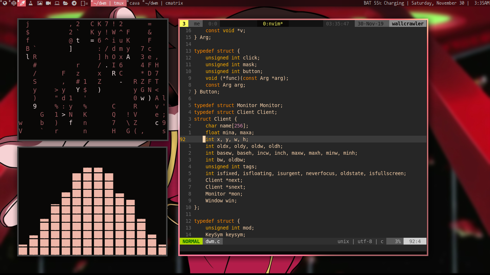
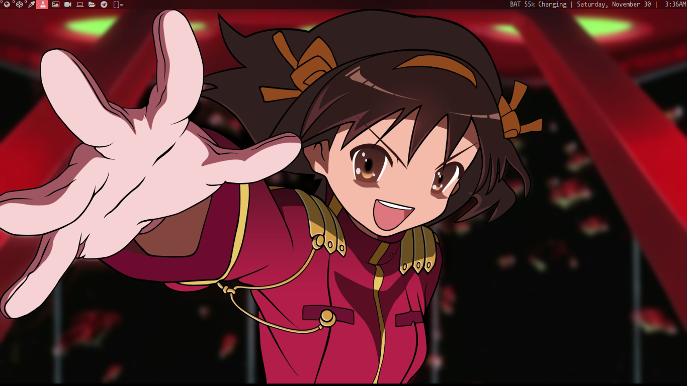

# DWM Config 

Just copy the dwm directories to your home and just compile.

# Install

Install the following application in your system :

* nm-applet
* compton-tryone-git
* Mononoki Nerd Font 
* Alacritty 
* pulseaudio 
* scrot
* lxappearance
* pywal

# Screenshots
### Neofetch

### VIM

